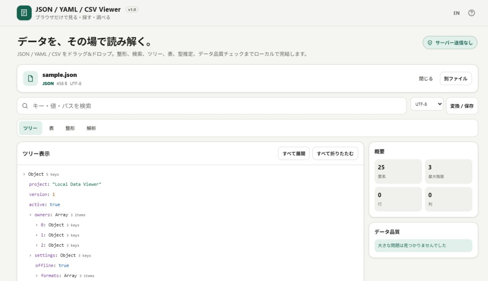

# JSON / YAML / CSV Viewer

[](https://github.com/ttomohisa/htmlapps-json-yaml-csv-viewer/actions/workflows/deploy-pages.yml)
[](LICENSE)
[](https://ttomohisa.github.io/htmlapps-json-yaml-csv-viewer/)

[English README](README.md)

JSON / YAML / CSV / TSV / JSON Lines を、ファイルを外部へアップロードせずに閲覧・検索・解析・品質チェック・変換できるローカルファーストの単一HTMLアプリです。

## 🚀 デモ

### [GitHub PagesでJSON / YAML / CSV Viewerを開く](https://ttomohisa.github.io/htmlapps-json-yaml-csv-viewer/)

GitHub Pagesから最初のHTMLを読み込んだ後、文字コード判定・パース・検索・ツリー/表表示・データ解析・品質チェック・スキーマ推定・変換は端末内で処理されます。選択したデータファイルをアプリがサーバーへアップロードすることはありません。



短い画面や拡大表示でもダイアログの内容をスクロールでき、開いている間は背景のページが動きません。

## 主な機能

- ドラッグ&ドロップまたはファイル選択で読み込み
- JSON / YAML / CSV / TSV / JSON Lines / NDJSON を自動判定
- JSON / YAML を展開可能なツリーで表示
- ツリーから値やJSONPath風のパス、オブジェクト・配列の部分データを整形JSONとしてコピー
- CSVやオブジェクト配列をページング付きの表で表示
- キー・値・パスをデータ全体から横断検索
- 正規化した整形テキストを表示
- 列ごとに型・欠損数・ユニーク数・数値Min/Max・文字列長を解析
- 型混在・欠損値・CSV重複ヘッダー・列数の不揃いなどを簡易チェック
- 読み込んだデータからJSON Schemaを自動推定
- JSON / YAML / CSV / JSON Schema へ変換して保存
- CSVのカンマ・TAB・セミコロン・パイプなどの区切り文字を自動判定
- UTF-8 / Shift_JIS / UTF-16LE に対応し、UTF-8 / Shift_JIS は可能な範囲で自動判定
- JSON Lines / NDJSON を正式な入力形式としてサポート
- 1つのHTML内で日本語 / English を切り替え
- PC / スマートフォン対応
- 実行時の外部通信、Analytics、Telemetry、アカウント登録、サーバーアップロードなし

## すぐに使う

### Webで使う

[デモを開く](https://ttomohisa.github.io/htmlapps-json-yaml-csv-viewer/)だけで利用できます。インストールやアカウント登録は不要です。

### 単一HTMLをダウンロードして使う

1. [`dist/index.html`](https://github.com/ttomohisa/htmlapps-json-yaml-csv-viewer/blob/main/dist/index.html) をダウンロードします。
2. 最新のChromiumベースのブラウザー、Firefox、Safariで直接開きます。
3. JSON / YAML / CSVなどのファイルをページへドロップします。

ローカルWebサーバーは不要で、生成済みHTMLは `file://` から直接利用できます。

### 自分でビルドして使う（advance）

1. このリポジトリをダウンロードまたはクローンします。
2. Windowsで `build-standalone.bat` をダブルクリックします。
3. `dist/` 以下に通常版と自己展開版の単一HTMLが生成され、検証も実行されます。
4. `dist/index.html` を好きな場所へコピーすれば、以降はインターネット接続なしでその1ファイルだけを開けます。

Python、Node.js、ローカルWebサーバーは不要です。Windows標準のPowerShellと `tar.exe` を使用します。

## 使い方

1. `.json` / `.yaml` / `.yml` / `.csv` / `.tsv` / `.jsonl` / `.ndjson` をドロップするか、ファイル選択から開きます。
2. 形式を自動判定し、区切りテキストでは文字コードや区切り文字も推定します。
3. **ツリー / 表 / 整形 / 解析** の表示を切り替えます。
4. 検索欄からキー・値・パスを横断検索します。
5. 解析画面で列プロファイル、簡易品質チェック、推定JSON Schemaを確認します。
6. 保存メニューからJSON / YAML / CSV / JSON Schemaへ変換してダウンロードします。

### 対応形式

| 形式 | 拡張子 | 補足 |
| --- | --- | --- |
| JSON | `.json` | オブジェクト・配列・スカラー値に対応 |
| YAML | `.yaml`, `.yml` | 一般的なYAMLのサブセットに対応。制限事項は後述 |
| CSV / TSV | `.csv`, `.tsv` | 区切り文字判定、表表示に対応 |
| JSON Lines / NDJSON | `.jsonl`, `.ndjson` | 空行を除き1行1JSONとして読み込み |

現在のファイルサイズ上限は **1ファイル50 MB** です。

### 文字コード

- UTF-8
- Shift_JIS
- UTF-16LE
- 日本語CSVを想定したUTF-8 / Shift_JISの自動判定

自動判定が合わない場合は、読み込み後にファイルツールバーから文字コードを変更できます。

## 単なる整形ツールとの違い

一般的なJSON / YAMLビューアは、構文色分けやPretty Printまでで終わるものが多いですが、このアプリは「別システムへ取り込む前にデータをざっと調べる」用途まで1つにまとめています。

- **複数形式を1つのUIで確認**：JSON / YAML / CSV / TSV / JSON Linesを同じ操作感で扱えます。
- **データプロファイル**：欠損、ユニーク数、型、値域、文字列長をすぐ確認できます。
- **簡易品質チェック**：列の型混在やCSVの列数不一致など、気付きにくい問題を表示します。
- **JSON Schema推定**：仕様書やバリデーションルールを作るためのたたき台を生成できます。
- **ローカル相互変換**：元データを外部へ送らずJSON / YAML / CSVへ変換できます。

## GitHub Pagesで公開する

このリポジトリには、単一HTMLを再ビルドして `dist/` をGitHub Pagesへ公開するワークフローが含まれています。

1. リポジトリ名を `htmlapps-json-yaml-csv-viewer` としてGitHubへプッシュします。
2. **Settings → Pages → Build and deployment → Source** で **GitHub Actions** を選択します。
3. `main` へプッシュするか、**Actions** 画面からPages用ワークフローを手動実行します。
4. 成功後、`https://ttomohisa.github.io/htmlapps-json-yaml-csv-viewer/` で公開されます。

Pagesがまだ有効になっていない場合も、ビルドと検証は成功させたうえでデプロイだけをスキップし、`configure-pages` のNot Foundでワークフロー全体が失敗しない構成にしています。

## 開発とビルド

```text
.
├─ src/index.template.html           # 編集するアプリ本体
├─ app.config.json                   # アプリ情報・ビルド設定
├─ dependencies.json                 # 内包依存の固定定義（現在はなし）
├─ build-standalone.bat              # Windows用ビルド入口
├─ build-standalone.ps1              # 単一HTML生成処理
├─ scripts/
│  ├─ check-repository.ps1           # リポジトリ全体のビルド・検証
│  ├─ build-self-extract.ps1         # gzip自己展開版の生成
│  ├─ verify-standalone.ps1          # 通常版の静的検証
│  └─ verify-self-extract.ps1        # 自己展開版の復元検証
├─ samples/                          # JSON / YAML / CSV / JSONL サンプル
├─ dist/
│  ├─ index.html                     # 生成される通常版の単一HTML
│  └─ index.self-extract.html        # 生成されるgzip自己展開版
└─ .github/workflows/
   ├─ build-standalone.yml           # Pull Request時のビルド検証
   └─ deploy-pages.yml               # mainからPagesへビルド・公開
```

開発時は `src/index.template.html` を編集し、生成物である `dist/` は直接編集しません。

リポジトリ全体の検証には、ヘッダー回帰テスト用の Node.js 22 以降が必要です。ビルド・検証する場合：

```powershell
powershell.exe -NoLogo -NoProfile -ExecutionPolicy Bypass -File .\scripts\check-repository.ps1
```

ビルド処理は以下を自動で行います。

- `src/index.template.html` と設定から `dist/index.html` を生成
- `dependencies.json` に定義された依存ファイルがあればHTML内へ内包
- `dist/dependency-manifest.json` にSHA-256などの監査情報を記録
- 未置換プレースホルダーや外部ランタイム参照が残っていないか検証
- gzip圧縮ペイロードを持つ `dist/index.self-extract.html` を生成
- 自己展開版からHTMLを復元し、`dist/index.html` とバイト単位で一致することを検証

## プライバシーと通信防止

生成されるHTMLはローカル処理を前提にしています。

- Content Security Policyに `connect-src 'none'` を指定
- 実行時CDN、外部フォント、Analytics、Telemetry、API通信なし
- 選択したファイル内容はブラウザーのメモリ上で扱い、アプリからサーバーへ送信しない
- ファイル保存はユーザー操作時に端末上で生成

GitHub Pages版では最初のHTMLを取得する通信は発生しますが、読み込んだデータファイルをアプリが外部へ送ることはありません。完全にオフラインで利用する場合は、生成済みの `dist/index.html` をローカルで開いてください。

セキュリティ境界は [SECURITY.md](SECURITY.md)、オフライン確認方法は [VERIFY_OFFLINE.md](VERIFY_OFFLINE.md) を参照してください。

## 制限事項

- 内蔵の軽量YAMLパーサーは、カスタムタグ、アンカー / エイリアス、複雑な複数ドキュメントYAMLには完全対応していません。
- JSON Schema推定はヒューリスティックな推定であり、本番用スキーマとして利用する前に内容の確認が必要です。
- CSVは最初に解析したレコードをヘッダーとして扱います。
- 非常に大きいデータや深くネストしたデータでは、ツリー全体の描画に時間やメモリを多く使用する場合があります。
- 現在は1回につき1ファイル、最大50 MBまでです。
- CSV保存は、読み込んだデータを表形式へ変換できる場合のみ利用できます。

## 使用ライブラリ

v1.0.6では、実行時に利用する**外部JavaScript / CSS / フォント / WASM / その他のサードパーティパッケージはありません**。ブラウザー標準APIとプロジェクト内のコードだけで動作します。

依存関係の方針とライセンス情報は [THIRD_PARTY_NOTICES.md](THIRD_PARTY_NOTICES.md) を確認してください。

## コントリビューション

バグ報告や機能提案はGitHub Issuesからお願いします。開発への参加方法は [CONTRIBUTING.md](CONTRIBUTING.md) を確認してください。

## ライセンス

Copyright © 2026 ttomohisa

このプロジェクトは [MIT License](LICENSE) で公開されています。

### 大容量データの回帰検証
`node --test scripts/test-large-data.cjs` と標準の `scripts/check-repository.ps1` を実行します。既存のNode.js用Playwright環境で `node scripts/test-large-data-browser.cjs` を実行できます。外部環境のnode_modulesは `NODE_PATH`、ブラウザーは `PLAYWRIGHT_BROWSER_CHANNEL`（既定msedge）で指定します。実ブラウザー検証は解析ビューで20万行CSVを開き、表と全件JSON書き出しを確認します。ツリー全体をDOM化する既存のメモリ・表示コストは今回の修正対象外です。

### ツリーの部分データをコピー

ツリー表示でオブジェクトや配列の「JSONをコピー」を選ぶと、その部分の解析済みデータを整形JSONとしてコピーできます。ルートや空のコンテナにも対応します。元ファイルの文字列ではないため、元の空白や数値表記は保存しません。非有限数や負のゼロなど、JSON化で値が変わる場合は理由を表示してコピーしません。既存の値・パスのコピーも利用できます。

ビルド後にルートのHTMLを更新し、`node --test scripts/test-tree-copy.cjs` でソース、通常版、ルート配布版、自己展開版の復元内容を検証できます。

## CSV / TSVの整数精度

CSV/TSVの数値がJavaScriptの安全な整数範囲（±9,007,199,254,740,991）を超える整数やオーバーフローになる場合は、元の文字列として保持します。安全な整数範囲を超える結果となる小数・指数表記も対象です。CSV・JSON・YAMLで保存して再読込しても文字列が維持され、スキーマと列解析では文字列型と表示されます。安全な数値や通常のスカラー型推定は変更しません。

任意精度の小数パーサーではありません。通常の小数やJSON/YAMLの数値入力は引き続きJavaScriptのNumberで扱います。標準ビルドとルート配布HTMLの更新後に `node scripts/test-csv-precision.cjs` で全配布版を、`src/index.template.html` を引数に指定するとソースだけを検証できます。標準リポジトリチェックにも精度検証を含みます。
